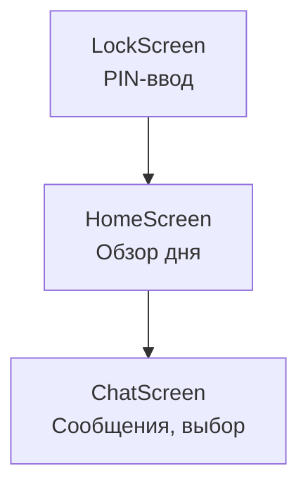

# Навигация по экранам

## Реализация в проекте
- **Поток**: 
  - **LockScreen**: Экран блокировки с вводом PIN для соответствия 152-ФЗ, отображается в тёмной теме с Jetpack Compose.
  - **HomeScreen**: Главный экран с обзором текущего дня и доступных действий (чаты, мини-игры).
  - **ChatScreen**: Экран чата с сообщениями, полем ввода и вариантами выбора.
- **Реализация**: Навигация реализована с `NavHost` и `NavController` в Compose, с сохранением состояния в `GameViewModel` и Room для офлайн-доступа.

## Взаимодействие с командой
- **Android-разработчик (Kotlin)**: Реализует навигацию с `NavHost`.
- **UI/UX-дизайнер**: Проектирует макеты экранов в Figma.
- **Геймдизайнер**: Определяет последовательность экранов.
- **QA-аналитик**: Тестирует переходы.
- **Тестер доступности**: Проверяет доступность для TalkBack.
- **Технический писатель**: Документирует навигацию.

## Кому подходит
- Подходит для Android-разработчика с опытом Compose и UI/UX-дизайнеров.

## Аспекты работы
- Требует тестирования переходов на разных устройствах.
- Состояние сохраняется локально.
- Документация включает схему навигации.

## Текстовая схема (Mermaid)
