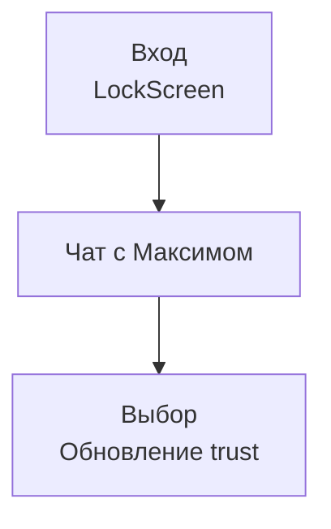

# Пользовательский путь (День 1)

## Реализация в проекте
- **Поток**: 
  - **Вход**: Аутентификация на `LockScreen`.
  - **Чат с Максимом**: Получение сообщения и выбор (например, "Сообщить").
  - **Выбор**: Обновление `trustLevel` и переход к мини-игре.
- **Реализация**: Управляется `GameEngine` и `ChatViewModel`, с сохранением в Room. Тёмная тема применяется ко всем экранам.

## Взаимодействие с командой
- **Android-разработчик (Kotlin)**: Реализует путь в `GameEngine`.
- **UI/UX-дизайнер**: Проектирует экраны пути.
- **Нарративный дизайнер**: Написывает чат с Максимом.
- **Геймдизайнер**: Определяет выборы.
- **Гейм-тестер**: Проверяет путь.
- **Технический писатель**: Документирует путь.

## Кому подходит
- Подходит для Android-разработчика и UI/UX-дизайнеров.

## Аспекты работы
- Требует тестирования всех шагов.
- Состояние сохраняется локально.
- Документация включает сценарий.

## Текстовая схема (Mermaid)
